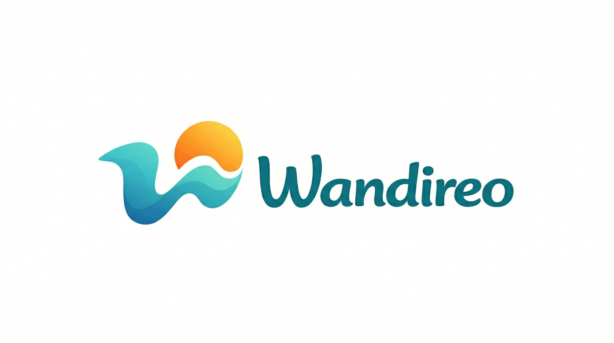

# Wandireo

Plateforme marketplace multi-verticale pour activites, mobilite et
hebergements premium.

`wandireo-api` est l'application Laravel + Inertia qui porte le site
public, les parcours connectes et les interfaces partenaire/admin de
Wandireo.



## Identite

- Marque: `Wandireo`
- Positionnement: travel marketplace premium
- Verticales: `Activites`, `Bateaux`, `Voitures`, `Hebergements`
- Univers visuel: lagon, bleu profond, accent solaire

## Ce que contient cette app

- backend Laravel 13 (PHP 8.4)
- frontend Inertia + React 19 + TypeScript
- authentification session/cookies avec Fortify + Sanctum
- recherche publique unifiee
- tunnel de reservation et espaces clients
- espace partenaire
- espace admin
- blog et support center admin-only

## Documentation

- [README-developpeur.md](README-developpeur.md)
- [README-produit.md](README-produit.md)
- [README-deploiement.md](README-deploiement.md)

## Demarrage rapide

```bash
composer install
npm install
cp .env.example .env
php artisan key:generate
php artisan migrate
composer run dev
```

## Commandes utiles

```bash
composer run dev
composer test
composer lint:check
npm run types:check
npm run lint:check
npm run format:check
php artisan optimize:clear
```

## Surfaces principales

### Public

- `/`
- `/recherche`
- `/services/{id}`
- `/blog`
- `/guide`

### Client

- `/mon-espace`
- `/mes-favoris`
- `/mes-reservations`
- `/mon-profil`

### Partenaire

- `/partenaire`
- `/partenaire/validation`
- `/partenaire/catalogue`
- `/partenaire/reservations`
- `/partenaire/profil`

### Admin

- `/admin`
- `/admin/utilisateurs`
- `/admin/services`
- `/admin/avis`
- `/admin/transactions`
- `/admin/support`
- `/admin/blog`

## Etat du produit

- recherche publique par hub unique avec segmentation par verticale
- home reliee a `/recherche`
- theme `light / dark / system`
- i18n multi-langue en cours d'harmonisation sur les ecrans restants
- blog public + edition admin
- support V1 admin-only
- creation admin de service sans partenaire obligatoire

## Notes

- Ce README couvre `wandireo-api` uniquement.
- Le monorepo contient aussi une autre app frontend a la racine.
- Les details techniques, produit et infra sont separes dans les README
  dedies ci-dessus.

# wandireo
